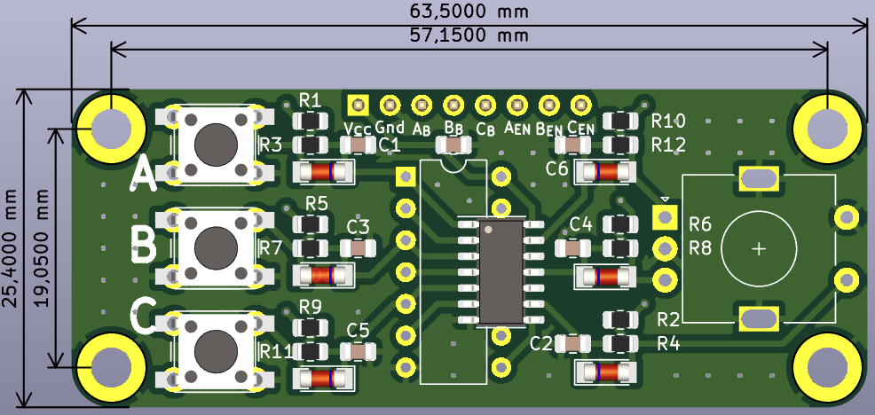

# Rotary encoder and Push-Buttons module with hardware debouncing

Module provides rotary encoder and 3 push-buttons with debouncing circuitry, based on 74xx14 inverting Schmitt trigger.

## Dimensions and layout

- overall dimensions: 1.0 in × 2.5 in
- mounting holes spacing : 0.75 in × 2.25 in
- mounting holes size : M3
- SMD sized:
	- Resistors: 0805
	- Capacitors : 0805
	- Diodes : MiniMELF

| Top View | Bottom View |
| ------ | ------|
|  |  |

## Schematics origin

Schematics is based on [this](https://my.eng.utah.edu/~cs5780/debouncing.pdf) work and is adjusted for:
- having both 1 rotary incremental encoder and 3 push buttons
- ability to solder eitehr SMD or DIP version of 74xx14 IC
- having option to push into breadboard or mount somewhere via mounting holes